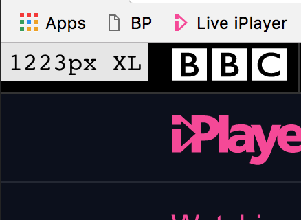

# Breakpoint Bookmarklet
A bookmarklet which shows current breakpoint and browser width.

Clicking the shortcut will toggle the information on and off.
You will need to ensure Chrome has `Show bookmarks bar` enabled under `Settings` > `Appearance`.

How to add (chrome):

1. Press the star on the right of the address bar to add a favourite.
2. Press `Edit` on the popup.
3. In `name` put a name like `BP`.
4. In the `URL` paste the code from this file: [bookmarklet.js](bookmarklet.js)

